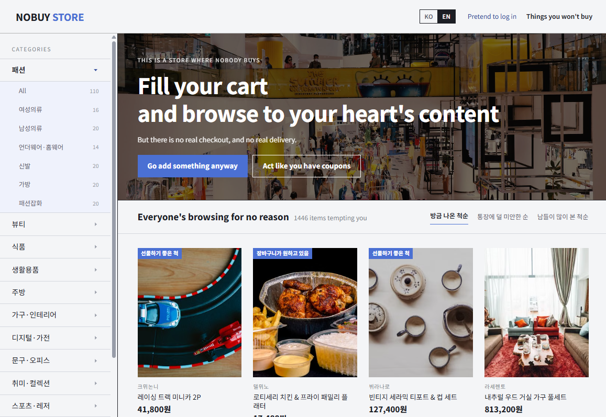

# NOBUY (안삼)

**[한국어](./README.md) | [English](./README.en.md)**

> A fake shopping mall where you only buy the urge to buy — never the actual product.

An interactive web project that lets you enjoy the browsing, cart, coupon, checkout,  
and delivery-tracking experience of an online store without ever making a real purchase.

## 🔗 Links

- Web: [Visit](https://fake-shop-frontend-ivory.vercel.app)
- GitHub: [Visit](https://github.com/sele906/fake-shop-frontend)

## 📷 Preview



## 💡 Motivation

The idea started from a simple observation: in online shopping, browsing products  
and adding them to a cart can be fun all on its own.

To let users feel that signature shopping-mall interaction and dopamine rush without any  
real payment, the project implements fake checkout, fake delivery tracking, coupons,  
hidden missions, and more.

## ✨ Features

- Product browsing across 12 top-level and 83 sub-level categories
- Product details with rating distribution, "load more" reviews, and related-product recommendations
- Cart management by option and quantity
- 58 coupon types with stacked, combined discounts
- 6 hidden missions scattered across the site, plus achievement coupons
- Fake checkout, animated delivery route, and restraint/dopamine gauges
- Receipts shareable through a single link, with no server involved
- Korean/English switching with automatic browser-language detection
- LocalStorage-based state persistence with real-time sync across tabs
- Responsive web UI

## 🛠 Tech Stack

### Frontend

- React 19.2
- Create React App (react-scripts 5.0.1)
- React Router DOM 6.30
- react-i18next 17.0 · i18next 26.3
- JavaScript ES2020+
- CSS Modules
- React Icons 5.7
- Sonner 2.0

### Deployment

- Vercel

## 🚀 Getting Started

```bash
git clone https://github.com/sele906/fake-shop-frontend.git
cd fake-shop-frontend
npm install
npm start
```

By default, the dev server runs at the address below.

```text
http://localhost:3000
```

## 📁 Project Structure

```text
src
├─ assets
├─ cart
├─ components
├─ coupon
├─ data
│  ├─ ko
│  ├─ en
│  └─ index.js
├─ hooks
├─ lib
├─ locales
│  ├─ ko
│  └─ en
├─ order
├─ pages
├─ receipt
├─ router
└─ i18n.js
```

## 🔍 Implementation Highlights

### JSON-based product data

So that a wide catalog could be browsed without a server, the data layer was designed in
JSON: 1,446 products, 18,872 reviews, 8,909 spec rows, 384 brands,
95 categories (12 top-level · 83 sub-level), and 58 coupon types.

Data generation was automated so that every product ends up with its own review count,
rating, authors, and posting dates.

### State persistence with LocalStorage

To keep cart and coupon state alive without login or a server, the necessary user data is
stored in LocalStorage.

Cases where nothing is stored, or where the stored data is malformed, are handled by
falling back to default values.

### Preventing duplicate coupon issuance

So that repeating the same mission never issues a coupon twice, mission-completion records
are kept in a store separate from the coupon wallet.

Saving the completion record, updating the coupon wallet, and showing the notification are
all handled in one place, so the issuing rules and the notification look identical no
matter which screen the mission lives on.

### Fake checkout and delivery interactions

Taking advantage of the fact that no real payment ever happens, flows such as payment
failure, package movement, and delivery arrival were built as playful UI.

The delivery screen is a 6-stage map that travels along an SVG path, with the animation
timed to finish exactly at the arrival moment.

### Receipts shared through a single link

The entire receipt is carried in the URL, with no server. The JSON is converted to UTF-8,
encoded as Base64URL, and appended after `/receipt?d=`.

The URL stores a snapshot of product names and quantities, so previously shared links
still open correctly even after the product data is regenerated.

### Korean and English localization

Multilingual support is implemented using language-specific JSON files in `src/locales`.

The visitor's browser language determines the initial language, and the selected language is saved in `localStorage` so it persists across future visits.

### Cross-tab state sync

So that changing the cart or coupons in one tab is reflected in other open tabs, the app
listens for the `storage` event, re-reads the stored value, and syncs its state.

## 🧩 Troubleshooting

### Persisting user state without a server

Problem:

- Cart and coupon data disappeared on refresh
- The same hidden mission could be triggered repeatedly

Solution:

- Sync data to LocalStorage whenever state changes
- Restore the stored data as initial state on app launch
- Assign unique IDs to coupons and missions to detect duplicates

### Building large volumes of product and review data

Problem:

- Review counts and contents differ per product, making manual authoring impractical
- Review ratings had to stay consistent with each product's average rating

Solution:

- Generated the data using Excel and JSON dictionaries
- Assigned individual ratings that match the content of each review
- Computed each product's rating as the average of its review ratings

### Korean product names breaking in receipt links

Problem:

- Putting the receipt in the URL requires Base64 encoding
- `btoa` only accepts Latin-1, so Korean product names threw an exception

Solution:

- Converted the string to UTF-8 bytes with `TextEncoder` before encoding
- Replaced the URL-unsafe `+` `/` `=` with `-` `_` to produce Base64URL
- Returned `null` on decode failure and fell back to an informational screen, in case the URL is truncated or corrupted

### Cross-tab sync waking tabs in an endless loop

Problem:

- Writing a change received from another tab straight back to storage made `storage` events bounce back and forth indefinitely
- Conversely, the `storage` event never fires in the tab that made the change, so the coupon
  wallet couldn't notice changes saved from another screen, such as hidden coupons

Solution:

- Compared against the existing value right before writing, and skipped the write when the content was identical
- Dispatched a `StorageEvent` manually within the same tab so open screens read the new value

## 📌 Data and Image Credits

- Product images are provided by Pexels.
- Product names, brands, descriptions, and reviews shown in the project are fictional.
- No real product sales or payments take place in this project.

## 🗺️ Roadmap

- Search by product name and brand
- Migrate to TypeScript
- Improve accessibility and responsive UI
- Add tests
