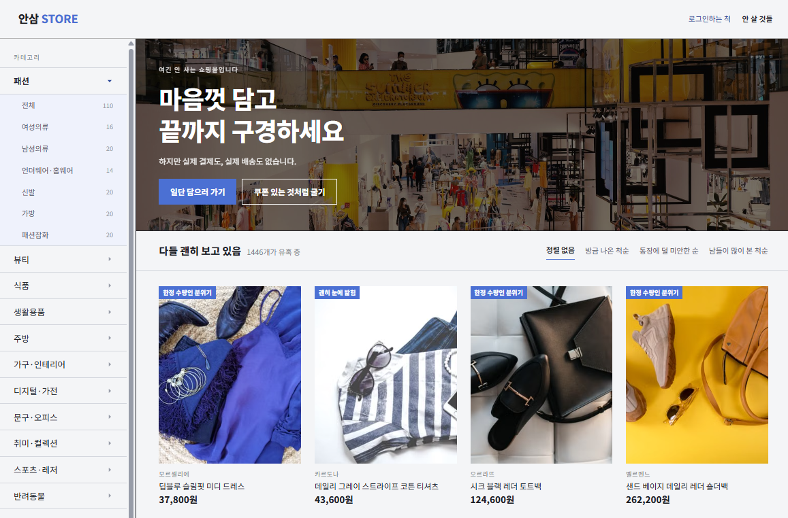

# 안삼 (ANSAM)

> 사고 싶은 마음만 사고, 실제 물건은 사지 않는 가짜 쇼핑몰

쇼핑몰의 탐색, 장바구니, 쿠폰, 결제, 배송 조회 경험을  
실제 구매 없이 즐길 수 있도록 만든 인터랙티브 웹 프로젝트입니다.

## 🔗 배포 링크

- Web: [바로가기](https://fake-shop-frontend-ivory.vercel.app)
- GitHub: [바로가기](https://github.com/sele906/fake-shop-frontend)

## 📷 미리보기



## 💡 기획 의도

온라인 쇼핑에서 상품을 둘러보고 장바구니에 담는 과정 자체가  
하나의 재미가 될 수 있다는 점에서 출발했습니다.

실제 결제 기능 없이도 쇼핑몰 특유의 인터랙션과 도파민을 경험할 수 있도록  
가짜 결제, 가짜 배송 조회, 쿠폰, 히든 미션 등의 기능을 구현했습니다.

## ✨ 주요 기능

- 카테고리별 상품 탐색 및 검색·정렬
- 상품 상세 정보와 리뷰 조회
- 장바구니 상품 관리
- 쿠폰 발급 및 적용
- 히든 미션 수행
- 가짜 결제와 배송 조회
- LocalStorage 기반 상태 유지
- 반응형 웹 UI

## 🛠 기술 스택

### Frontend

- React
- React Router DOM
- JavaScript
- CSS Modules
- React Icons

### Deployment

- Vercel

### Data & State

- JSON 기반 상품 데이터
- LocalStorage 기반 클라이언트 상태 관리

## 🚀 실행 방법

```bash
git clone https://github.com/sele906/fake-shop-frontend.git
cd fake-shop-frontend
npm install
npm start
```

개발 서버는 기본적으로 아래 주소에서 실행됩니다.

```text
http://localhost:3000
```

## 📁 프로젝트 구조

```text
src
├─ api
├─ assets
├─ components
├─ data
├─ pages
├─ routes
├─ styles
└─ utils
```

## 🔍 주요 구현 내용

### JSON 기반 상품 데이터 구성

서버 없이도 다양한 상품을 탐색할 수 있도록
상품, 카테고리, 리뷰, 브랜드, 스펙 데이터 1446건을 JSON 구조로 설계했습니다.

상품마다 서로 다른 리뷰 수, 별점, 작성자와 작성일을 가지도록
데이터 생성 과정을 자동화했습니다.

### LocalStorage 상태 유지

로그인이나 서버 없이도 장바구니와 쿠폰 상태가 유지되도록
LocalStorage에 필요한 사용자 데이터를 저장했습니다.

저장된 데이터가 없거나 형식이 올바르지 않은 경우를 고려해
기본값으로 복구하도록 처리했습니다.

### 쿠폰 중복 발급 방지

동일한 미션을 반복해도 쿠폰이 여러 번 발급되지 않도록
쿠폰 ID를 기준으로 보유 여부를 확인했습니다.

쿠폰 발급, 알림 표시, 쿠폰함 반영 과정을 분리해
각 상태가 독립적으로 관리되도록 구현했습니다.

### 가짜 결제와 배송 인터랙션

실제 결제가 이루어지지 않는 프로젝트 특성을 활용해
결제 실패, 배송 이동, 상품 도착 등의 과정을 위트 있는 UI로 구성했습니다.

## 🧩 트러블 슈팅

### 서버 없이 사용자 상태를 유지하는 문제

문제:

- 새로고침하면 장바구니와 쿠폰 정보가 사라짐
- 동일한 히든 미션이 반복 실행될 수 있음

해결:

- 상태가 변경될 때 LocalStorage에 데이터를 동기화
- 앱 실행 시 저장 데이터를 초기 상태로 복원
- 쿠폰과 미션에 고유 ID를 부여해 중복 여부 확인

### 대량의 상품 및 리뷰 데이터 구성

문제:

- 상품마다 리뷰 수와 내용이 달라 수작업 작성이 어려움
- 리뷰 별점과 상품 평균 별점의 일관성이 필요함

해결:

- 엑셀과 JSON 사전을 활용해 데이터를 생성
- 리뷰 내용에 맞춰 개별 별점을 부여
- 리뷰별 별점의 평균으로 상품 별점을 계산

## 📌 데이터 및 이미지 출처

- 상품 이미지는 Pexels에서 제공하는 이미지를 사용했습니다.
- 프로젝트에 표시되는 상품명, 브랜드, 설명과 리뷰는 가상의 데이터입니다.
- 본 프로젝트에서는 실제 상품 판매 및 결제가 이루어지지 않습니다.

## 🗺️ 향후 개선 계획

- TypeScript 적용
- 접근성 및 반응형 UI 개선
- 테스트 코드 추가
- 다국어 지원