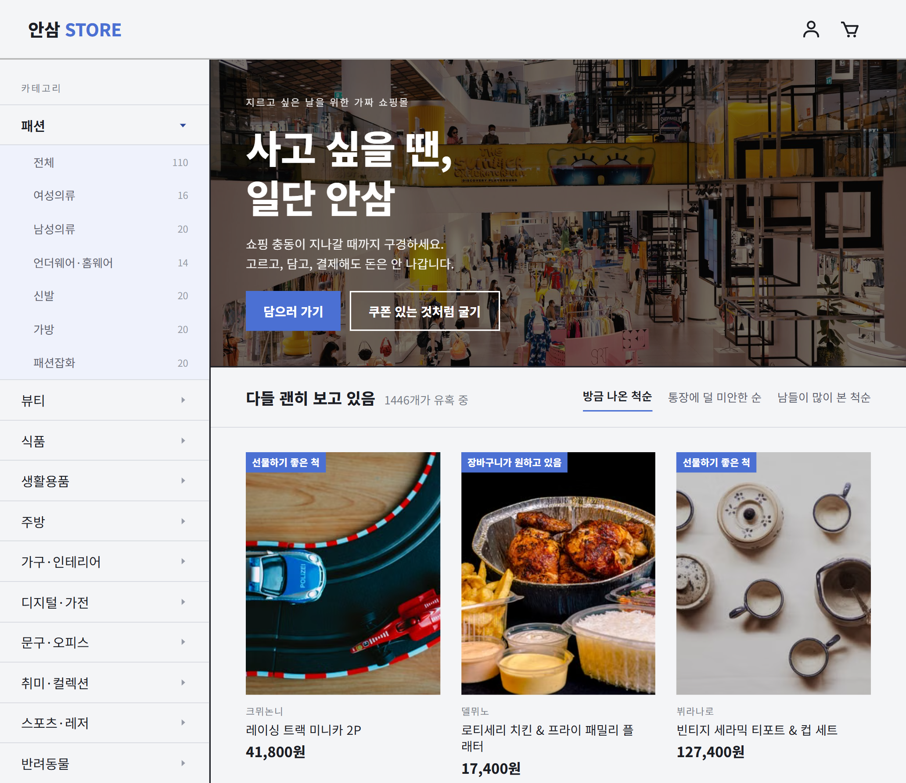

# 안삼 (NOBUY)

**[한국어](./README.md) | [English](./README.en.md)**

> 사고 싶은 마음은 챙기고, 결제는 두고 가세요.

**안삼**은 상품을 구경하고, 장바구니에 담고, 쿠폰을 받고, 결제하고 배송을 기다리는
**쇼핑의 전 과정을 실제 구매 없이 경험할 수 있는 가짜 쇼핑몰**입니다.

실제 상품도, 실제 결제도, 실제 배송도 없습니다.
대신 쇼핑몰에서 느낄 수 있는 탐색과 선택의 재미를 인터랙션으로 구현했습니다.

### 🔗 바로가기

[웹에서 안삼 보기](https://fake-shop-frontend-ivory.vercel.app)

---

## 📷 미리보기



---

## ✨ 주요 기능

|             |          |
| ----------- | -------- |
| **1,446개**  | 가상의 상품   |
| **18,872개** | 상품 리뷰    |
| **95개**     | 카테고리     |
| **58종**     | 쿠폰       |
| **6종**      | 히든 미션    |
| **2개 언어**   | 한국어 · 영어 |
| **2개 플랫폼**  | 웹 · 안드로이드 앱 |

### 쇼핑 경험

* 12개 대분류 · 83개 소분류의 상품 탐색
* 상품 옵션 및 장바구니 관리
* 별점 분포, 리뷰 더보기, 연관 상품 추천
* 쿠폰 발급 및 중복 할인
* 가짜 결제와 배송 조회
* 절제 · 도파민 게이지
* 사이트 곳곳에 숨겨진 히든 미션과 업적 쿠폰
* 링크로 공유할 수 있는 영수증

### 사용자 경험

* 한국어 · 영어 전환
* 다크 · 라이트 모드와 시스템 설정 연동
* LocalStorage 기반 상태 유지
* 반응형 웹 UI
* 안드로이드 앱 (Google Play 심사 중)

---

## 🛠 기술 스택

### 프론트엔드

`React` `JavaScript` `React Router` `i18next` `CSS Modules`

### 앱

`Capacitor` `Android`

### 배포

`Vercel` `Google Play (심사 중)`

### 데이터

서버 없이 동작할 수 있도록 상품, 리뷰, 브랜드, 카테고리, 쿠폰 데이터를 JSON으로 구성했습니다.

---

# 🔍 구현

## 1. 서버 없는 쇼핑몰

안삼은 로그인과 백엔드 서버 없이도 쇼핑몰의 주요 흐름을 경험할 수 있도록 설계했습니다.

장바구니, 쿠폰, 히든 미션 진행 상태처럼 사용자별로 유지되어야 하는 정보는
`localStorage`에 저장하고 앱 실행 시 다시 복원합니다.

저장된 데이터가 없거나 예상하지 못한 형식인 경우에는
기본 상태로 복구하도록 처리했습니다.

---

## 2. 1,400개 이상의 상품 데이터 구성

다양한 상품을 실제 쇼핑몰처럼 탐색할 수 있도록 다음 데이터를 직접 구성했습니다.

* 상품 1,446개
* 리뷰 18,872개
* 상품 스펙 10,727행
* 브랜드 384개
* 카테고리 95개
* 쿠폰 58종

대량의 리뷰를 수작업으로 작성하는 대신 엑셀과 JSON 사전을 이용해 데이터 생성 과정을 자동화했습니다.

각 리뷰에는 서로 다른 작성자와 작성일, 내용, 별점을 부여했고
리뷰별 별점 평균을 이용해 상품의 평균 별점을 계산했습니다.

---

## 3. 중복되지 않는 히든 미션과 쿠폰

사이트 곳곳에서 특정 행동을 하면 히든 미션이 완료되고 쿠폰이 지급됩니다.

같은 행동을 반복해도 쿠폰이 여러 번 발급되지 않도록
쿠폰 보유 여부와 별도로 **미션 달성 기록**을 저장했습니다.

```text
사용자 행동
   ↓
미션 조건 확인
   ↓
달성 여부 확인
   ↓
미션 기록 저장
   ↓
쿠폰 지급
   ↓
공통 알림 표시
```

미션이 어느 페이지에서 실행되더라도 같은 규칙을 사용하도록
달성 처리와 쿠폰 지급 로직을 한 곳에서 관리합니다.

---

## 4. 링크 하나로 공유되는 영수증

영수증 공유를 위해 별도의 서버나 데이터베이스를 사용하지 않습니다.

영수증 내용을 JSON으로 만든 뒤 UTF-8 바이트로 변환하고
Base64URL로 인코딩해 URL 파라미터에 담습니다.

```text
영수증 데이터
→ JSON
→ UTF-8
→ Base64URL
→ /receipt?d=...
```

상품 데이터가 나중에 변경되더라도 이전에 공유한 영수증이 달라지지 않도록
링크에는 상품 ID 대신 상품명과 수량 등의 **스냅샷 데이터**를 저장합니다.

잘리거나 손상된 URL이 전달된 경우에는 디코딩 실패를 감지해
오류 안내 화면으로 대체합니다.

---

## 🌏 다국어 지원

`src/locales`의 언어별 JSON 파일을 이용해 한국어와 영어를 지원합니다.

```text
src/locales
├─ ko
└─ en
```

첫 방문에서는 브라우저 언어를 감지해 언어를 선택하고,
사용자가 직접 고른 언어는 `localStorage`에 저장해 다음 방문에도 유지합니다.

---

## 🚚 가짜 결제와 배송

실제로 결제가 발생하지 않는 프로젝트의 특성을 활용해
결제와 배송 과정 자체를 하나의 인터랙션으로 구성했습니다.

배송 조회는 SVG 경로 위를 이동하는 6단계 애니메이션으로 구현했으며
배송 단계와 애니메이션 진행 시간을 맞춰 상품이 이동하는 것처럼 표현했습니다.

---

## 📱 웹사이트이면서 앱

같은 코드가 브라우저에서도 동작하고, Capacitor로 감싼 안드로이드 앱으로도 동작합니다.

```bash
npm run build:app   # 웹을 빌드하고 결과물을 앱으로 복사합니다
```

앱에서만 달라지는 부분은 다음과 같습니다.

* 기기의 뒤로가기 버튼 — 열려 있는 드로어나 모달을 먼저 닫고,
  이전 화면이 있으면 뒤로 이동하고, 첫 화면에서는 두 번 눌러야 종료됩니다.
* 길게 누르기 메뉴와 드래그 선택 같은 브라우저 기본 동작을 해제했습니다.
* 폰트를 앱 안에 포함해 실행 직후부터 글자가 그려집니다.
* 다크/라이트모드 전환 시 상태바 테마도 함께 전환됩니다.

공유 링크는 App Links로 앱에서 바로 열립니다.
영수증(`/receipt`)과 상품 상세(`/product/`) 두 경로만 받도록 제한해
사이트의 다른 링크는 웹으로 열리게 했습니다.
앱을 설치하지 않은 경우 같은 주소가 그대로 웹페이지로 열립니다.

---

## 🌗 다크 · 라이트 모드

색상을 CSS 변수로 모아두고 `<html>`의 `data-theme` 속성 하나로 두 팔레트를 전환합니다.

라이트 · 다크 · 시스템 세 가지 중에서 선택할 수 있으며
선택한 값은 `localStorage`에 저장해 다음 방문에도 유지합니다.

앱에서는 선택한 값을 네이티브에도 전달해 상태바까지 함께 전환되도록 처리했습니다.

---

# 🧩 문제 해결

<details>
<summary><strong>영수증 링크에서 한글 상품명이 깨지는 문제</strong></summary>

### 문제

브라우저의 `btoa()`는 Latin-1 문자열만 처리할 수 있기 때문에
한글 상품명이 포함된 영수증을 곧바로 Base64로 변환하면 오류가 발생했습니다.

### 해결

`TextEncoder`를 사용해 문자열을 UTF-8 바이트로 변환한 뒤 Base64로 인코딩했습니다.

URL에서 안전하게 사용할 수 있도록

* `+` → `-`
* `/` → `_`
* `=` 제거

과정을 거쳐 Base64URL 형태로 변환했습니다.

</details>

<details>
<summary><strong>히든 미션을 반복하면 쿠폰이 중복 발급되는 문제</strong></summary>

### 문제

쿠폰 보유 여부만 확인하면 쿠폰이 사용된 이후
같은 미션을 다시 실행했을 때 또 발급될 수 있었습니다.

### 해결

쿠폰함과 별도로 미션 달성 기록을 저장하고
이미 달성한 미션인지 먼저 검사하도록 변경했습니다.

</details>

<details>
<summary><strong>Android App Links가 디버그에서는 열리지만 배포 앱에서는 웹으로 열리는 문제</strong></summary>

### 문제

웹의 특정 URL을 Android 앱으로 연결하기 위해 App Links를 설정했습니다.

로컬 디버그 빌드에서는 링크가 정상적으로 앱으로 열렸지만,
Google Play를 통해 설치한 배포 버전에서는 같은 링크가 브라우저로 열렸습니다.

`assetlinks.json`에 로컬에서 확인한 인증서 fingerprint를 등록했음에도
배포 앱에서는 도메인 검증이 이루어지지 않았습니다.

### 원인

Google Play에서 배포되는 앱은 로컬에서 빌드할 때 사용한 키가 아니라
**Google Play App Signing 인증서**로 다시 서명됩니다.

따라서 디버그 또는 업로드 키의 SHA-256 fingerprint만
`assetlinks.json`에 등록하면 Play Store에서 받은 앱의 서명과 일치하지 않습니다.

### 해결

Google Play Console에서 실제 배포 앱에 사용되는
**App Signing 인증서의 SHA-256 fingerprint**를 확인해 `assetlinks.json`에 추가했습니다.

개발 환경에서도 App Links를 확인할 수 있도록
디버그 인증서와 배포 인증서를 함께 등록하여 도메인 연결을 검증했습니다.

```json
[
  {
    "relation": ["delegate_permission/common.handle_all_urls"],
    "target": {
      "namespace": "android_app",
      "package_name": "com.ansam.app",
      "sha256_cert_fingerprints": [
        "PLAY_APP_SIGNING_SHA256_FINGERPRINT",
        "DEBUG_SHA256_FINGERPRINT"
      ]
    }
  }
]
```

수정 후 Play Store에서 설치한 앱에서도 공유 링크가 정상적으로 앱으로 연결되었습니다.

</details>

---

## 📁 프로젝트 구조

```text
.
├─ android
├─ public
│  ├─ .well-known
│  ├─ fonts
│  └─ index.html
└─ src
   ├─ assets
   ├─ cart
   ├─ components
   ├─ coupon
   ├─ data
   │  ├─ ko
   │  └─ en
   ├─ hooks
   ├─ lib
   ├─ locales
   │  ├─ ko
   │  └─ en
   ├─ order
   ├─ pages
   ├─ receipt
   ├─ router
   ├─ App.js
   └─ i18n.js
```

---

## 🚀 실행 방법

```bash
git clone https://github.com/sele906/fake-shop-frontend.git
cd fake-shop-frontend

npm install
npm start
```

개발 서버는 기본적으로 `http://localhost:3000`에서 실행됩니다.

---

## 📌 데이터와 이미지

* 상품 이미지는 **Pexels**에서 제공하는 이미지를 사용했습니다.
* 상품명, 브랜드, 설명, 리뷰는 프로젝트를 위해 제작한 가상의 데이터입니다.
* 안삼에서는 실제 상품 판매, 결제 및 배송이 이루어지지 않습니다.

---

## 🗺️ 향후 계획

* 상품명 · 브랜드 검색
* TypeScript 적용
* 접근성 개선
* 테스트 코드 작성
